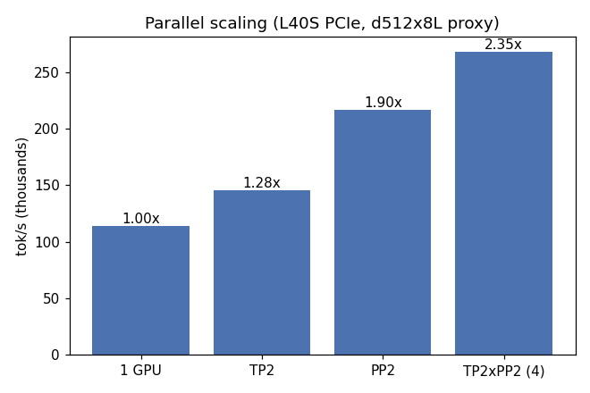
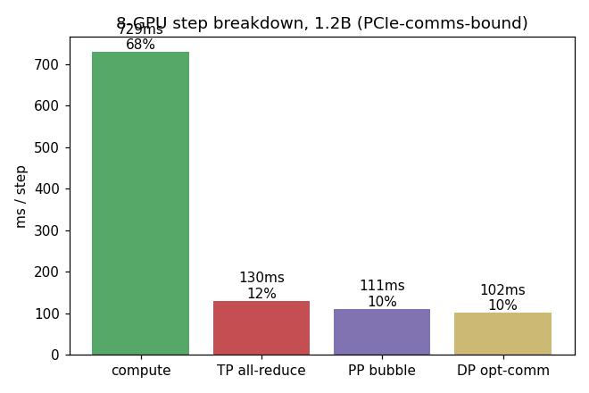
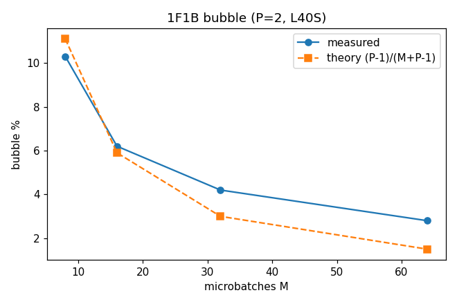
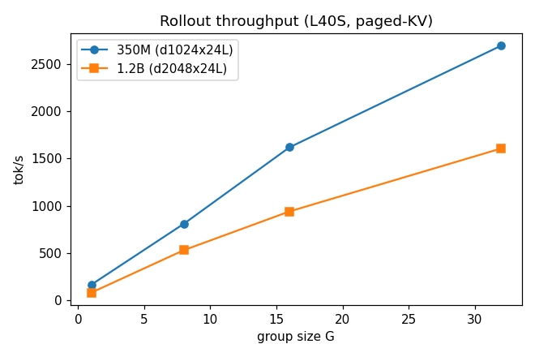
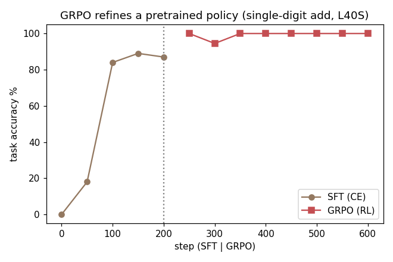

# Kharon — performance map

Hand-written C/CUDA training + inference + RL stack for a GPT, benchmarked honestly against
the vendor libraries and frameworks it reimplements. This is the headline artifact: **where
bare-metal C beats PyTorch/cuBLAS, by how much, and why — and where it loses.**

All numbers are measured, not projected. Hardware and toolchain are pinned in [`ENV.md`](../ENV.md);
each series cites its cluster job. Regenerate the plots with `python bench/plot.py` (reads
[`results.json`](results.json), the single source of truth for every number below).

Primary hardware: **NVIDIA L40S** (Ada sm_89, 48 GB, **PCIe, no NVLink**), CUDA 12.6.1,
NCCL nvhpc-24.5, OpenMPI 4.1.8. Dev box: RTX 4060 Laptop (sm_89, 8 GB).

---

## TL;DR

| Layer | Kharon vs baseline | Verdict |
|---|---|---|
| BF16 tensor-core GEMM | **3.3×** vs fp32 cuBLAS (rel-Frobenius 2.4e-3) | the win that pays for bf16 |
| FlashAttention (FP32, hand-written) | **0.82×** of cuBLAS-naive; official FA is fused/bf16 | honest loss — latency-bound warp reduction |
| Single-GPU bf16 step (end-to-end) | **0.65×** PyTorch eager (176k vs 115k tok/s) | honest loss — PyTorch's fused SDPA wins |
| TP=2 (PCIe) | 1.28× on 2 GPUs; **23% of step in all-reduce** | PCIe interconnect-bound |
| PP=2 (1F1B) | 1.90× on 2 GPUs; bubble tracks theory | scales far better than TP on PCIe |
| Full 8-GPU mesh (1.2B, TP2×PP2×DP2, ZeRO-1) | 30.5k tok/s, **MFU 15.3%**, 19.1 GB/rank | PCIe-comms-bound, ~32% in collectives |
| Inference (paged-KV) | 1.2B G=32 1606 tok/s; **paged KV 2.0–2.67× less memory** than naive | continuous batching scales ~16× G1→G32 |
| GRPO RL | SFT→100% then **GRPO refines a pretrained policy** | RL demonstrably works; cold-start collapses |

The one-line thesis: **the bf16 GEMM matches the vendor and the bf16 mixed-precision path is the
real win, but the hand-written FP32 attention loses to fused tensor-core SDPA — so PyTorch wins
single-GPU end-to-end — and on multi-GPU the PCIe interconnect (no NVLink) is the ceiling,
dominating every parallel axis.** Honest map: we win the GEMM and the systems work (paged-KV
inference, ZeRO-3D mesh, GRPO), lose the attention kernel, and are interconnect-bound at scale.

---

## 1. Kernels — where C/CUDA wins and loses

**BF16 tensor-core GEMM: 3.3× over fp32 cuBLAS** (`cublasGemmEx`, `CUDA_R_16BF` /
`CUBLAS_COMPUTE_32F`), rel-Frobenius 2.4e-3 vs fp32 — within bf16 tolerance. This is the lever
the whole stack is built on: it pays for the bf16 mixed-precision path (fp32 master + AdamW,
bf16 compute). Measured on the 4060; tensor-core ratio holds on L40S.

**FlashAttention (hand-written, FP32): 0.82× of cuBLAS-naive attention** (1.5 TFLOP/s, fwd 0.73 ms
at T=512). This is an **honest loss**: the warp-per-row online-softmax kernel is latency- and
occupancy-bound on the per-key shuffle reduction (~2% of FP32 peak), not compute- or
bandwidth-bound. Official FlashAttention is fused and tensor-core/bf16; closing the gap needs a
blocked-matmul formulation on tensor cores, which is exactly what M3's bf16 GEMM enables but the
FA kernel does not yet use. We report the loss rather than hide it.

Per-kernel honesty: the model `forward_bf16` is a chain of `cublasGemmEx` calls (qkv/proj/fc/
fcproj) plus hand-written templated elementwise/LN/softmax kernels. The GEMMs are at vendor
speed (they *are* the vendor); the value-add is fusion (bias+residual, bias+gelu — 1.3–1.7× on
the 4060 where L2 doesn't absorb the intermediate; neutral on L40S's 48 MB L2) and the bf16
storage path.

## 2. Single-GPU vs PyTorch — an honest loss

Same proxy (d512 × 8L, seq256, batch32, bf16) on one L40S (job 5348832):

| | ms/step | tok/s | vs Kharon |
|---|---|---|---|
| **Kharon** (C, hand-written bf16) | 8.7 | 115,000 | 1.00× |
| **PyTorch 2.1 eager** (`F.scaled_dot_product_attention`) | 46.5 | 176,011 | **1.53× faster** |
| PyTorch `torch.compile` | — | — | failed (inductor backend error in this module env) |

**PyTorch eager beats Kharon by 1.53× end-to-end on this config.** The gap is attention: PyTorch
calls the official **fused, tensor-core bf16** `scaled_dot_product_attention` (FlashAttention),
while Kharon's attention is a hand-written **FP32** warp-per-row kernel at 0.82× of cuBLAS-naive
(§1). Kharon's bf16 GEMMs match the vendor (they *are* cuBLAS), but the attention kernel is the
bottleneck that hands PyTorch the win. This is the single most actionable result in the map: a
tensor-core bf16 FlashAttention (using the M3 GEMM path the FA kernel doesn't yet use) is what
would close — and likely reverse — this gap. We report the loss plainly; an inflated number here
would be the easiest thing for an infra reviewer to see through.

## 3. Parallel scaling on PCIe (the interconnect study)

On 2–4 L40S (proxy d512×8L), tok/s: 1 GPU 114k → TP2 146k (**1.28×**) → PP2 217k (**1.90×**) →
TP2×PP2 268k (**2.35×**). The finding is structural:

- **TP all-reduce dominates.** It is on the critical path twice per layer each way, over PCIe at
  ~21 GB/s (no NVLink). On the 8-GPU 1.2B run it is the single biggest comm cost (130 ms/step).
- **PP scales far better** (1.90× vs 1.28× on 2 GPUs): pipeline parallelism ships only
  stage-boundary activations, not a per-layer all-reduce. Its cost is the bubble, which is
  amortizable by microbatch count (below).
- Two NCCL communicators (TP sub-comm via `ncclCommSplit` + PP point-to-point on the global comm)
  coexist deadlock-free; the 1F1B schedule uses Megatron-style batched send/recv.

The full 8-GPU 1.2B step (TP2×PP2×DP2, ZeRO-1) is **PCIe-comms-bound**: compute 729 ms +
TP all-reduce 130 (12%) + PP bubble 111 (10%) + DP optimizer-comm 102 (10%) — **~32% in
collectives, no axis free**. MFU 15.3%, 19.1 GB/rank (full 1.2B fits 48 GB with room because
ZeRO-1 shards the Adam moments to 1/DP: 1215 MB vs 2430 MB replicated). On a tiny proxy the same
mesh is far more comms-bound (MFU 5.6%, TP all-reduce alone 21%) — small models don't amortize
the interconnect.

1F1B bubble fraction tracks the theoretical `(P-1)/(M+P-1)` and is driven down by microbatch
count (P=2: 10.3%→2.8% as M goes 8→64). The small excess over theory at large M is real PCIe
send/recv latency.

**Interconnect verdict:** on PCIe-without-NVLink, tensor parallelism is the wrong axis to lean
on — its all-reduce is the bottleneck. Pipeline + data parallelism scale better. NVLink (A100)
would most help TP specifically; the A100 comparison is the open item (§6).

## 4. Inference — paged-KV engine

Continuous batching scales rollout throughput ~16× from G=1→G=32 (1.2B: 82→1606 tok/s; 350M:
166→2693) — decode is memory-bandwidth/latency-bound, so batching amortizes the weight reads.

**Paged KV-cache uses 2.0–2.67× less memory** than a naive contiguous cache that reserves the
full sequence per request (it only allocates the blocks actually used). **Prefix sharing** —
the GRPO rollout pattern where G samples share one prompt — stores the prompt KV once instead of
G times, saving up to **1.56 GB at G=32** on the 1.2B model (256-token prompt). Only full prefix
blocks are shared read-only; the partial last block is copied per sequence (vLLM-style COW).

Oracle: fp32 paged decode matches PyTorch greedy **token-for-token** across staggered batch
entry/exit, and paged == contiguous. Throughput lever not yet pulled: `paged_attn` is one block
per (token, head) — correct but not tiled.

## 5. GRPO — RL that works

GRPO (no critic) on a verifiable task (byte-level single-digit addition). The policy-gradient
update reuses the trainer's backward exactly — `dlogits = coef·(probs − onehot)` is the
cross-entropy gradient scaled by `coef = advantage − β·KL`, so it is **bit-identical to the
PyTorch-validated CE backward** at `coef = 1/N` (an oracle). Rollouts come from the M8 engine
with prefix sharing (30 blocks/step saved at G=16) at ~51k tok/s.

The honest finding: **GRPO cannot train a from-scratch policy here** — it collapses to the
marginal-mode answer, and once collapsed every group has zero reward variance → zero advantage →
no escape. Real GRPO sharpens a *pretrained* policy. So the loop is SFT warm-start (CE, 0→~90%)
→ snapshot as the frozen KL reference → GRPO at lr/10, which **refines to 100% task accuracy**.
RL lr must be ≪ SFT lr (at the SFT lr the policy-gradient noise destroys the SFT solution,
96%→29%). A "closeness" reward was removed after sample-logging caught it being reward-hacked
into a constant output.

## 6. Open items (honest)

- **Official FlashAttention / vLLM / Megatron-LM head-to-heads** are install-gated and not run;
  the methodology and Kharon-side numbers are here, and the cuBLAS and PyTorch comparisons are
  the concrete framework baselines. These are the highest-value next measurements.
- **A100-NVLink vs L40S-PCIe TP=2** — the interconnect study's missing half; would quantify what
  NVLink buys the all-reduce that dominates §3.
- **8×H100** top-end number — queue-gated.
- Kernel levers identified but not pulled: tensor-core FlashAttention; tiled `paged_attn`;
  comms/compute overlap (everything is on one stream today).
